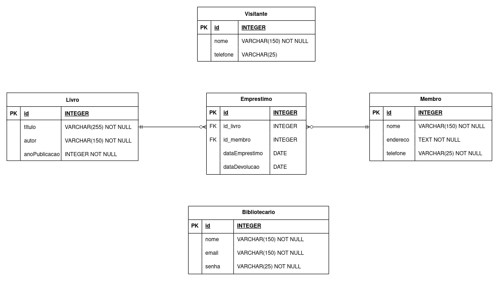

# FMT Library Manager Restful API

Este projeto é uma API RESTful para o gerenciamento de uma biblioteca simples. Utiliza JDK 17 e banco de dados 
PostgreSQL com o esquema de banco de dados especificado. Esta é uma atividade desenvolvida dentro do módulo de 
Backend Java, **Lab365**, SENAI - Florianópolis, SC.


## Autor

Sou a Barbara Calderon, desenvolvedora de software.
- [Github](https://www.github.com/barbaracalderon)
- [Linkedin](https://www.linkedin.com/in/barbaracalderondev)
- [Twitter](https://www.x.com/bederoni)

## Schema do Banco de Dados

Abaixo, representação do banco de dados para o projeto desenvolvido.



## Endpoints da API

### /bibliotecario
| Método | Endpoint                            | Descrição                                                     |
|--------|-------------------------------------|---------------------------------------------------------------|
| POST   | `/bibliotecario`                    | Cria um novo bibliotecário.                                   |
| GET    | `/bibliotecario`                    | Retorna todos os bibliotecários cadastrados.                  |
| GET    | `/bibliotecario/{idBibliotecario}` | Retorna o bibliotecário com o ID especificado.                |
| PUT    | `/bibliotecario/{idBibliotecario}` | Atualiza os dados do bibliotecário com o ID especificado.     |
| DELETE | `/bibliotecario/{idBibliotecario}` | Remove o bibliotecário com o ID especificado.                 |
| GET    | `/bibliotecario/emails`             | Retorna os emails de todos os bibliotecários cadastrados.      |
| PUT    | `/bibliotecario/{idBibliotecario}/senha` | Atualiza a senha do bibliotecário com o ID especificado. |


### /emprestimo
| Método | Endpoint                           | Descrição                                                     |
|--------|------------------------------------|---------------------------------------------------------------|
| POST   | `/emprestimo`                      | Cria um novo empréstimo.                                      |
| GET    | `/emprestimo`                      | Retorna todos os empréstimos cadastrados.                     |
| GET    | `/emprestimo/{idEmprestimo}`       | Retorna o empréstimo com o ID especificado.                   |
| PUT    | `/emprestimo/{idEmprestimo}`       | Atualiza os dados do empréstimo com o ID especificado.        |
| DELETE | `/emprestimo/{idEmprestimo}`       | Remove o empréstimo com o ID especificado.                    |


### /livro
| Método | Endpoint                      | Descrição                                                     |
|--------|-------------------------------|---------------------------------------------------------------|
| POST   | `/livro`                      | Cria um novo livro.                                           |
| GET    | `/livro`                      | Retorna todos os livros cadastrados.                          |
| GET    | `/livro/{idLivro}`            | Retorna o livro com o ID especificado.                        |
| PUT    | `/livro/{idLivro}`            | Atualiza os dados do livro com o ID especificado.             |
| DELETE | `/livro/{idLivro}`            | Remove o livro com o ID especificado.                         |
| GET    | `/livro/titulos`              | Retorna todos os títulos dos livros cadastrados.              |
| GET    | `/livro/autores`              | Retorna todos os autores dos livros cadastrados.              |


### /membro
| Método | Endpoint                      | Descrição                                                     |
|--------|-------------------------------|---------------------------------------------------------------|
| POST   | `/membro`                     | Cria um novo membro.                                          |
| GET    | `/membro`                     | Retorna todos os membros cadastrados.                         |
| GET    | `/membro/{idMembro}`          | Retorna o membro com o ID especificado.                       |
| PUT    | `/membro/{idMembro}`          | Atualiza os dados do membro com o ID especificado.            |
| DELETE | `/membro/{idMembro}`          | Remove o membro com o ID especificado.                        |
| GET    | `/membro/nomes`               | Retorna todos os nomes dos membros cadastrados.               |
| GET    | `/membro/telefones`           | Retorna todos os telefones dos membros cadastrados.           |
| PUT    | `/membro/{idMembro}/telefone` | Atualiza o telefone do membro com o ID especificado.          |


### /visitante
| Método | Endpoint                       | Descrição                                                     |
|--------|--------------------------------|---------------------------------------------------------------|
| POST   | `/visitante`                   | Cria um novo visitante.                                       |
| GET    | `/visitante`                   | Retorna todos os visitantes cadastrados.                      |
| GET    | `/visitante/{idVisitante}`     | Retorna o visitante com o ID especificado.                    |
| PUT    | `/visitante/{idVisitante}`     | Atualiza os dados do visitante com o ID especificado.         |
| DELETE | `/visitante/{idVisitante}`     | Remove o visitante com o ID especificado.                     |


## Tecnologias Utilizadas

- **Spring Boot Starter Web**: Framework para o desenvolvimento de aplicativos da web em Java.
- **Spring Boot DevTools**: Ferramenta para desenvolvimento mais produtivo no ambiente Spring Boot.
- **Project Lombok**: Biblioteca que reduz a verbosidade do código Java.
- **Spring Boot Starter Data JPA**: Facilita a implementação de persistência de dados usando Spring Data e JPA.
- **PostgreSQL**: Banco de dados relacional.
- **Maven**: Gerenciador de dependências e construção de projetos.
- **Java 17**: Versão da linguagem de programação Java utilizada no projeto.


## Executando o Projeto

Antes de executar o projeto, certifique-se de ter o JDK 17 e o PostgreSQL instalados em sua máquina.

1. Clone o repositório do projeto:
    ```bash
    git clone git@github.com:barbaracalderon/fmt-library-manager.git
    ```

2. Acesse o diretório do projeto:
    ```bash
    cd fmt-library-manager
    ```

3. Configure o banco de dados PostgreSQL:

    - Crie um banco de dados com o nome `fmt_library_manager_db` (sugestão)
    - Insira suas configurações no arquivo `application.properties`:

```properties
# arquivo application.properties
spring.application.name=library
server.port=8080
spring.datasource.url=jdbc:postgresql://localhost:5432/fmt_library_manager_db
spring.datasource.username=postgres
spring.datasource.password=[digite sua senha]
spring.datasource.driver-class-name=org.postgresql.Driver
spring.jpa.properties.hibernate.format_sql=true
spring.jpa.hibernate.ddl-auto=update
spring.jpa.show-sql=true


```

4. Execute o projeto:
    ```bash
    ./mvnw spring-boot:run
    ```

O servidor será iniciado em http://localhost:8080.

## Testando os Endpoints

Você pode testar os endpoints utilizando ferramentas como Postman, Insomnia ou cURL. Por exemplo, usando Insomnia:

- Para listar todos os livros:
    ```bash
    GET http://localhost:8080/livro
    ```

- Para criar um novo livro:
    ```bash
    POST http://localhost:8080/livro

    Body:
    {
      "titulo": "Nome do livro",
      "autor": "Nome do autor",
      "anoPublicacao": 1912
    }
    ```

Certifique-se de substituir os valores de exemplo pelos valores reais.

### Atividade

Esta foi uma atividade da semana 9, execução própria de uma proposta de projeto.